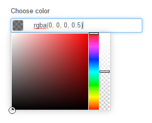

# DEPRECATED! Minicolor colorpicker


This form field will show `rgba` or `hex` color picker using [jquery-minicolors](https://github.com/claviska/jquery-minicolors).

> **Note:** Joomla! official GitHub repo has merged [PR](https://github.com/joomla/joomla-cms/pull/7602) which results in same and more possibilities. So, before using this, please check if your Joomla! version (>= 3.6) supports new `color` form field.



## Options (attributes)

**Inherited options**

- **position**: where should colorpicker appear? Options are `left` and `right`.
- **control**: determines the type of control. Valid options are `hue`, `brightness`, `saturation`, and `wheel`. Defaults to `hue`.

**Custom options**

- **format**: format used. Valid options are `hex` and `rgb`.
- **opacity**: default opacity used. From `0.0` to `1.0`.

## Example usage

````xml
<field
  name="color"
  type="minicolor"
  label="Choose color"
  format="rgb"
  opacity="0.5" />
```

## Changelog

**2016-04-06** Initial release
